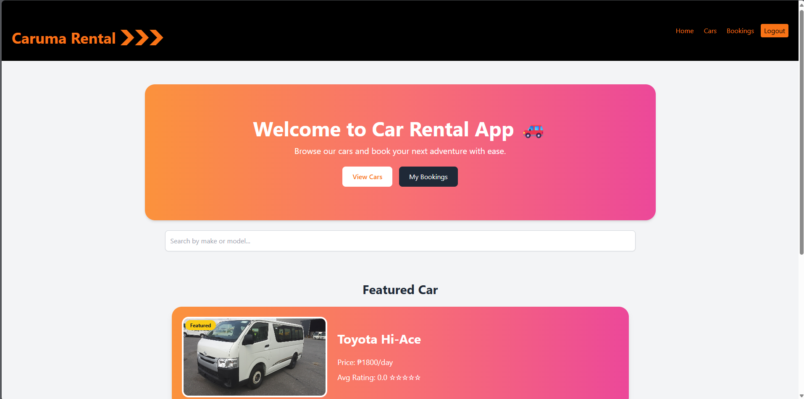
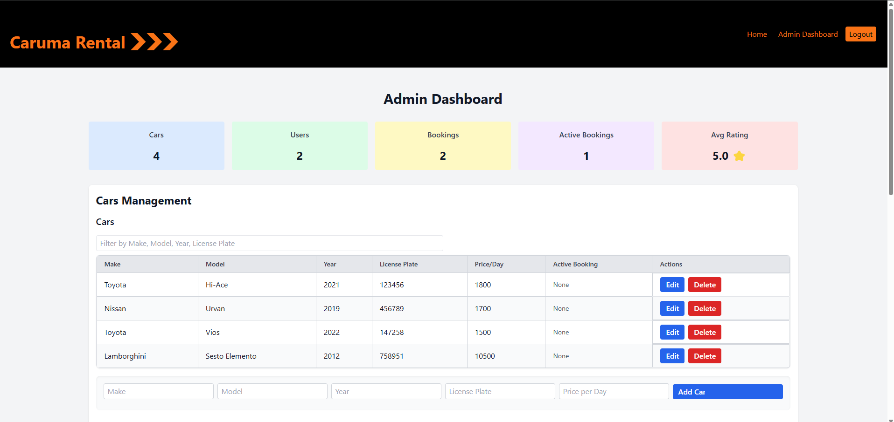
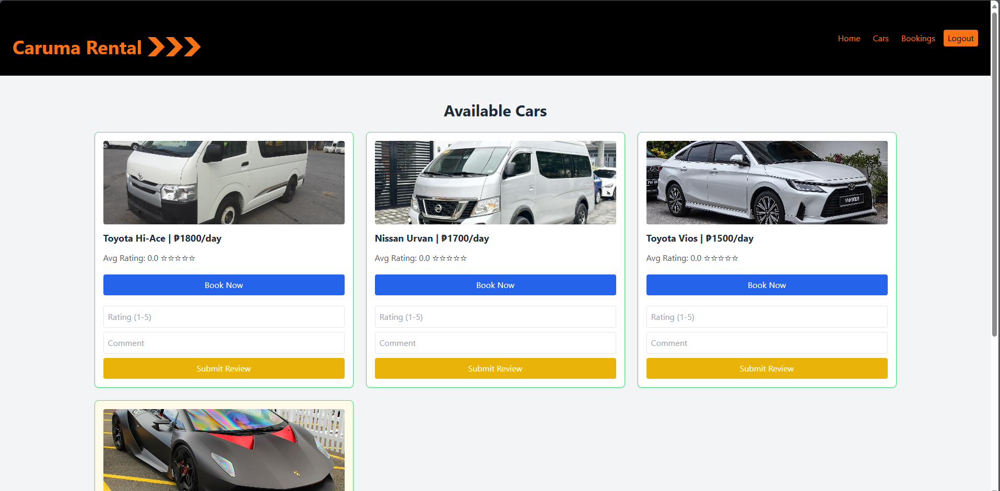
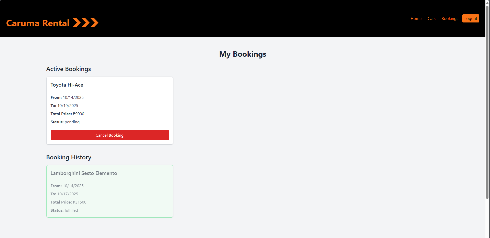

# 🚗 MERN Car Rental App

A full-stack Car Rental Web Application built with the MERN stack (MongoDB, Express.js, React.js, Node.js).
This app allows users to browse cars, make bookings, leave reviews, and manage rentals, while admins can add cars, manage bookings, and oversee the platform.

---

## ✨ Features

# 👤 User Features
* Register and login with JWT authentication
* Browse available cars
* Book cars and manage bookings (view, cancel, update)
* Leave reviews and ratings for cars

## 🛠 Admin Features
* Add, update, and delete cars
* View all bookings
* Manage users and reviews
* Access dashboard with insights

---

## 🏗 Tech Stack

* Frontend: React.js, Context API, Axios, TailwindCSS/Bootstrap
* Backend: Node.js, Express.js
* Database: MongoDB (Mongoose ODM)
* Authentication: JWT + bcrypt
* Cloud & DevOps (optional setups):
  * AWS EC2 for hosting backend/frontend
  * S3 for static file storage
  * GitHub Actions CI/CD
  * Dockerized deployment
 
---

## 📂 Project Structure
```bash
car-rental-app/
├── .github/                    # GitHub Actions workflows
│   └── workflows/
├── backend/                    # Backend: Express API
│   ├── config/                 # Database configuration
│   ├── controllers/            # Route handlers
│   ├── middleware/             # Custom middleware
│   ├── models/                 # Mongoose models
│   ├── routes/                 # API routes
│   ├── server.js               # Express server setup
│   └── .env                    # Environment variables
├── frontend/                   # Frontend: React app
│   ├── public/                 # Public assets
│   ├── src/                    # Source code
│   ├── .env                    # Environment variables
│   ├── package.json            # Frontend dependencies and scripts
│   └── README.md               # Frontend documentation
├── postman/                    # Postman collection for API testing
│   └── car-rental-api.postman_collection.json
├── terraform/                  # Infrastructure as Code (IaC)
│   └── main.tf                 # Terraform configuration
├── .dockerignore               # Docker ignore file
├── .gitignore                  # Git ignore file
├── README.md                   # Project overview and setup instructions
├── docker-compose.yml          # Docker Compose configuration
├── package.json                # Backend dependencies and scripts
├── test-bcrypt.js              # Bcrypt hashing test
└── test-password.js            # Password hashing test
```

---


## 🚀 Getting Started

# 🔧 Prerequisites
Make sure you have installed:
* Node.js (>= 18)
* MongoDB (local or Atlas)
* Git

## ⚙️ Local Installation & Testing
1. Clone the repository:
```bash
git clone https://github.com/marcsman007/car-rental-app.git
cd car-rental-app
```

2. Install dependencies for both backend and frontend:
```bash
cd backend
npm install

cd ../frontend
npm install
```

3. Create a .env file in /backend with:
```ini
MONGO_URI=your_mongo_connection_string
JWT_SECRET=your_secret_key
PORT=5000
NODE_ENV=development
```
* MONGO_URI → MongoDB connection string (local or remote)
* JWT_SECRET → Secret key for authentication
* PORT → Backend server port
* NODE_ENV → Set to development for local testing

Optional: In the frontend .env file (/frontend/.env), set:
```env
REACT_APP_API_URL=http://localhost:5000
```

4. Run the development servers:
Backend:
```bash
cd backend
npm run dev
```
* Starts backend at http://localhost:5000
* Uses nodemon for hot reload (if installed)

Frontend:
```bash
cd frontend
npm start
```
* Starts React development server at http://localhost:3000
* Hot reload enabled for frontend changes

5. Access the app at:
```arduino
http://localhost:3000
```
* Test user registration (admin & normal user)
* Test login, dashboards, bookings, and car CRUD operations

---

## 📦 Deployment
* Dockerized: Build and run containers
* AWS Setup: Deployed with EC2, ALB, and S3 for static assets
* CI/CD: GitHub Actions automate build and deployment

---

## 🖼️ Screenshots

### Homepage


### Admin Dashboard


### Cars Page


### Bookings Page


---

## 🛡 License
This project is licensed under the MIT License.

---

## 👨‍💻 Contributors
[Marc Jayson Macaburas](https://github.com/marcsman007) – Developer
